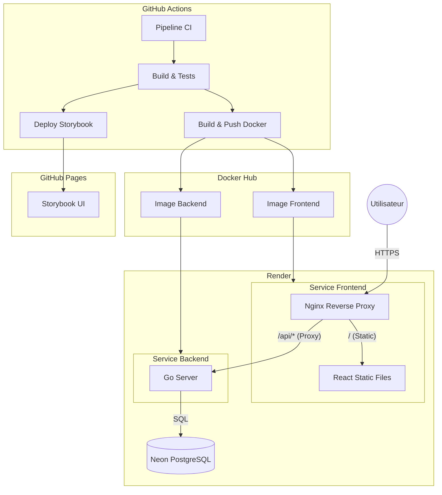

# Architecture et Déploiement

Ce document décrit l'architecture globale du projet "Christmas Gift Manager", sa stratégie de conteneurisation, et son pipeline de déploiement continu (CI/CD).

## 1. Vue d'ensemble

Le projet est une application web complète composée d'un frontend (React/Vite) et d'un backend (Go), déployée via des conteneurs Docker sur la plateforme Render. La documentation des composants (Storybook) est hébergée séparément sur **GitHub Pages**.

### Schéma d'Architecture



## 2. Stratégie de Conteneurisation (Multi-stage Builds)

Pour optimiser la taille des images et la sécurité, nous utilisons des builds Docker multi-étapes (Multi-stage builds) pour le frontend et le backend.

### Frontend

L'image frontend combine le serveur web et l'application :

1.  **Stage Builder (`node:trixie-slim`)** : Installation des dépendances (pnpm), compilation TypeScript et build Vite.
2.  **Stage Runner (`nginx:latest`)** : Une image légère qui ne contient que les fichiers statiques compilés (`/dist`) et la configuration Nginx. Node.js n'est pas présent dans l'image finale.

### Backend

L'image backend suit une logique similaire :

1.  **Stage Builder** : Compilation du code Go en un binaire exécutable.
2.  **Stage Runner** : Une image minimale contenant uniquement le binaire compilé.

## 3. Reverse Proxy & Routing (Nginx)

Le frontend n'est pas seulement un serveur de fichiers statiques ; il agit comme point d'entrée unique grâce à **Nginx**.

### Configuration Nginx

Le fichier `nginx.conf.template` est injecté au démarrage du conteneur. Il gère deux types de trafic :

1.  **Fichiers Statiques (`/`)** :

    - Sert l'application React (SPA).
    - Gère le fallback `try_files $uri $uri/ /index.html` pour le routing côté client (React Router).

2.  **API Proxy (`/api/`)** :
    - Redirige toutes les requêtes commençant par `/api/` vers le service Backend sur Render.
    - **Avantage** : Évite les problèmes de CORS (Cross-Origin Resource Sharing) car le navigateur ne voit que le domaine du frontend.
    - **Configuration** : Utilise la variable d'environnement `${API_URL}` pour cibler dynamiquement le backend.

```nginx
location ^~ /api/ {
    proxy_pass ${API_URL};
    proxy_set_header X-Real-IP $remote_addr;
}
```

## 4. Pipeline CI/CD (GitHub Actions)

Le déploiement est entièrement automatisé via GitHub Actions, défini dans `.github/workflows/`.

### Workflow Principal (`main.yml`)

Déclenché sur les pushs vers `main` :

1.  **Installation & Cache** : Installation de Node.js, Go, et pnpm avec mise en cache agressive.
2.  **Qualité du Code** :
    - Linting (ESLint) et formatage (Prettier/Go fmt).
    - Tests Unitaires (Vitest pour le front, Go test pour le back).
    - Tests E2E (Playwright) sur plusieurs navigateurs.
    - Tests de composants (Storybook).
3.  **Documentation** : Build et déploiement de Storybook sur **GitHub Pages**.

### Workflow de Déploiement

Une fois les tests validés :

1.  **Docker Push** : Construction et push des images sur Docker Hub avec le tag `latest` et le SHA du commit.
2.  **Render Deploy** : Appel des Webhooks de déploiement Render pour mettre à jour les services Frontend et Backend avec les nouvelles images.

## 5. Infrastructure & Environnements

### Plateforme de Déploiement : Render

L'application est hébergée sur **Render**

- **Environnements** : Bien que l'infrastructure Render soit configurée pour supporter deux environnements distincts (**Staging** et **Production**), seul l'environnement de **Production** est actuellement déployé automatiquement via le pipeline CI/CD pour cet exercice.
- **Services** :
  - `tp-final-frontend` : Service Web Docker (Nginx + React).
  - `tp-final-backend` : Service Web Docker (Go).

### Base de Données : Neon
